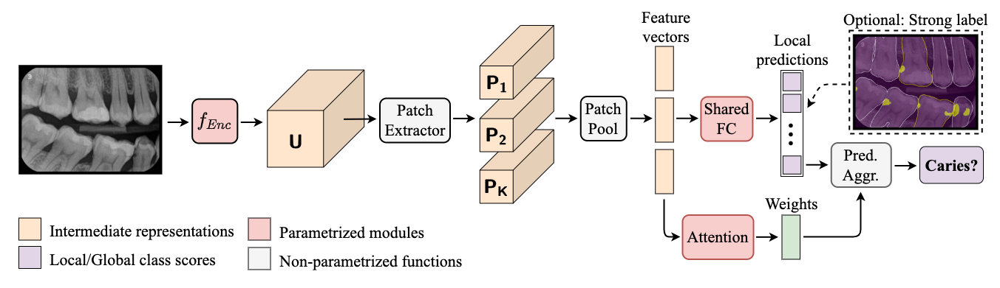
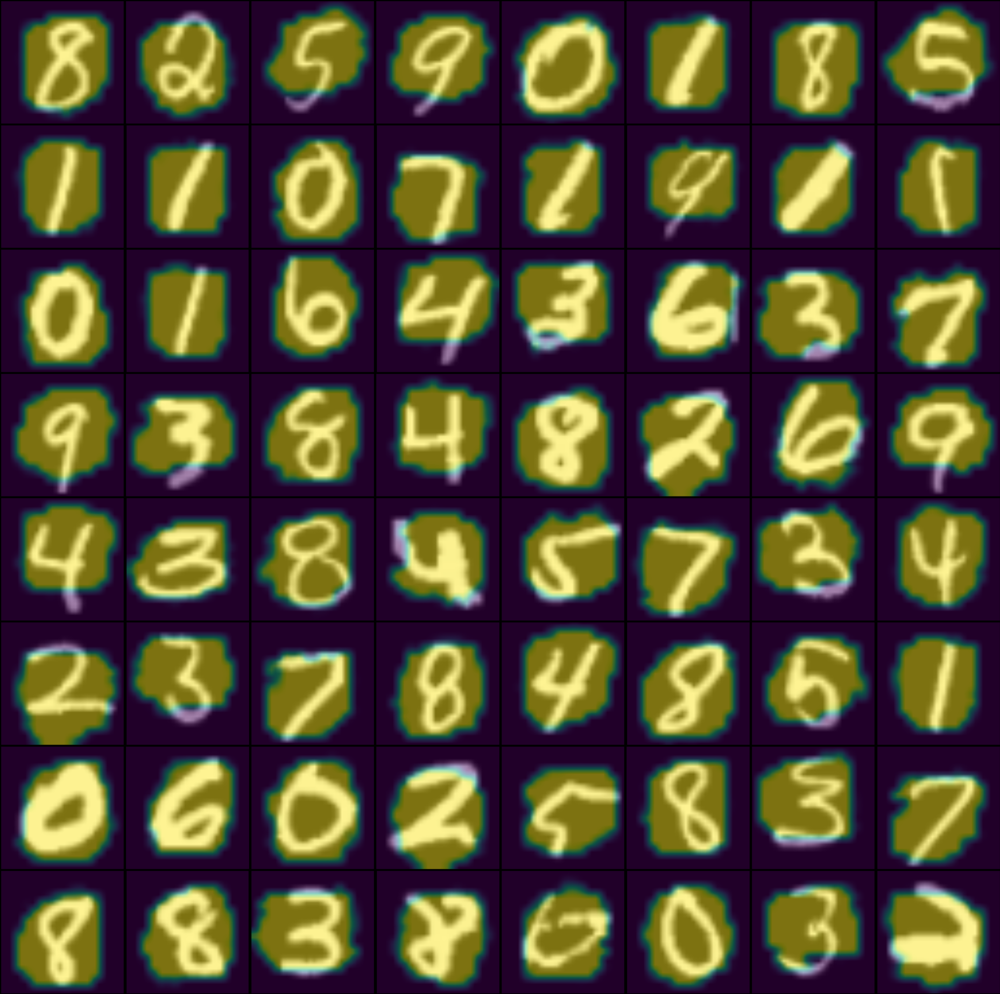

# EMIL

Implementation of the EMIL architecture. Illustrated with MNIST and a simplified ResNet backbone.

## Usage
```python
import torch
from emil import EMIL

net = EMIL(
  output_type = 'multiclass',
  num_inp_channels = 1,
  num_fmap_channels = 128,
  att_dim = 128,
  num_classes = 10,
  patch_size = 1,
  patch_stride = 1,
  k_min = 100
)

img = torch.randn(1, 1, 32, 32)

pred, pred_local, pred_weight = net(img, output_heatmaps=True) # (1, 10), (1, k, 10),  (1, k, 1)
```

`pred_local` holds local patch predictions, `pred_weight` holds attention weights.

## Parameters
`output_type`: string.<br />
Either `multiclass` or `binary`

`num_inp_channels`: int.<br />
Number of input channels

`num_fmap_channels`: int.<br />
Number of channels of the last conv layer

`att_dim`: int.<br />
Number of hidden dimensions in gated attention

`num_classes`: int.<br />
Number of classes

`patch_size`: int.<br />
Patch size in embedding space

`patch_stride`: int.<br />
Patch stride in embedding space

`k_min`: int.<br />
Minimum number of patches to achieve full class score. Default value is based on a maximum number of 16x16=256 patches.

## Visualization
Both `pred_local` and `pred_weight` can be visualized as heatmaps. We show an example for MNIST for k_min=100.


